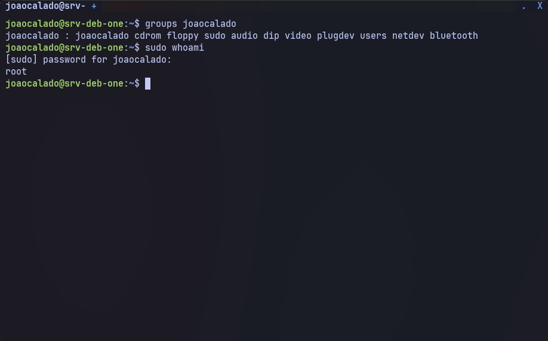
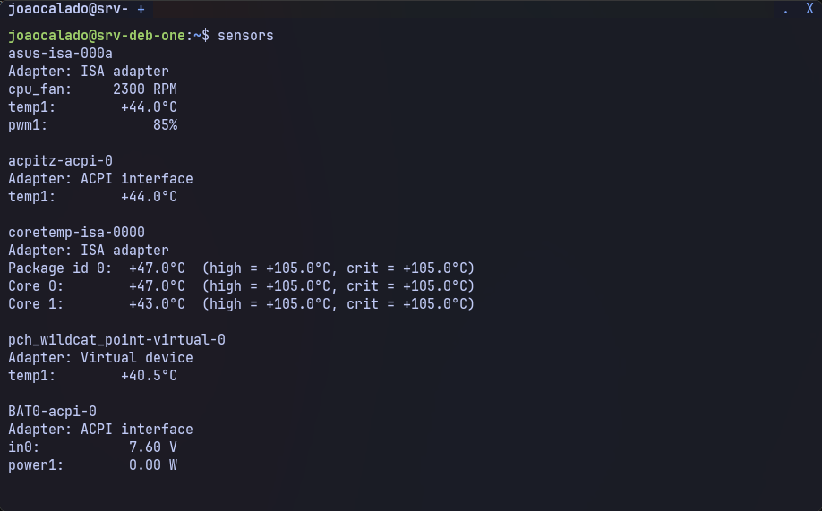
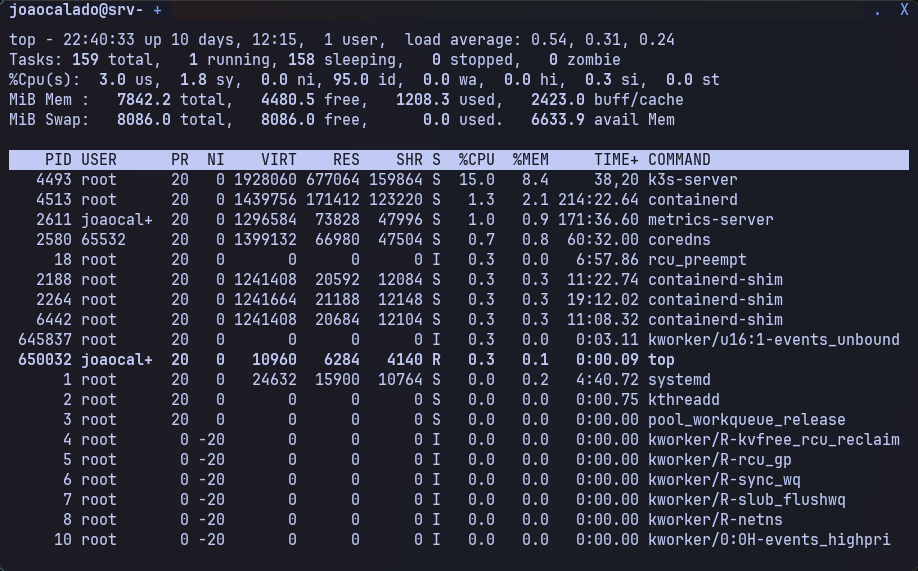
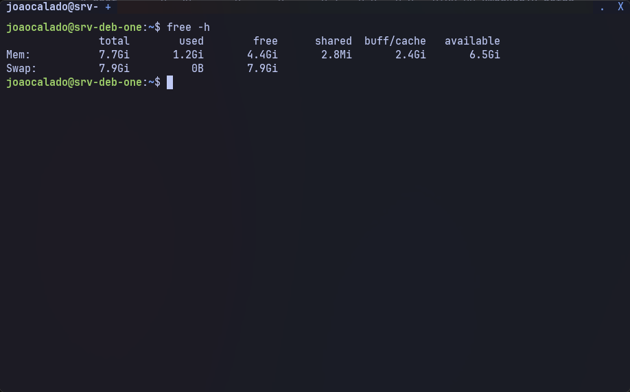
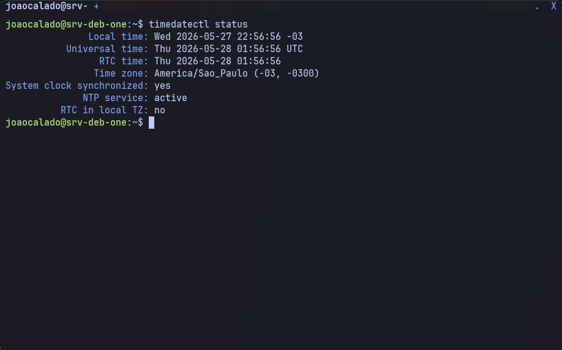

# 1. Preparação inicial do sistema

## 1.1. Instalar `sudo` e `curl`

1. Comando:

```sh
apt update && apt install sudo curl -y
```

2. Descrição:

```text
apt update: Sincroniza os índices de pacotes locais com os repositórios remotos, garantindo que a versão mais recente das definições de software seja utilizada.

apt install sudo curl -y: Instala o pacote sudo (para executar comandos como superusuário) e o curl (ferramenta de transferência de dados via HTTP/HTTPS). A flag -y confirma automaticamente todos os prompts do sistema.
```

---

## 1.2. Adicionar usuário ao grupo `sudo`

Substitua `joaocalado` pelo seu nome de usuário.

1. Comando:

```sh
usermod -aG sudo joaocalado
```

2. Descrição:

```text
usermod -aG sudo joaocalado: Adiciona o usuário 'joaocalado' ao grupo 'sudo'. A opção -aG significa "append to group" (adiciona aos grupos suplementares). O grupo sudo concede privilégios administrativos completos.
```

**Verificação:**

1. Comando:

```sh
groups joaocalado
sudo whoami
```

2. Descrição:

```text
groups joaocalado: Lista todos os grupos dos quais o usuário faz parte. Deve incluir 'sudo'.
sudo whoami: Executa o comando 'whoami' como superusuário. Se retornar 'root', o sudo está funcionando corretamente.
```

3. Saída:


**Segurança (remoção do sudo, se necessário):**

1. Comando:

```sh
sudo gpasswd -d joaocalado sudo
```

2. Descrição:

```text
Remove o usuário 'joaocalado' do grupo sudo, revogando seus privilégios administrativos.
```

---

## 1.3. (Opcional) Instalar `lm-sensors` para monitorar temperaturas

Útil para garantir que o notebook não superaqueça, especialmente se ficar ligado 24/7.

1. Comando:

```sh
sudo apt install lm-sensors -y
sudo sensors-detect --auto
sensors
```

2. Descrição:

```text
lm-sensors: Pacote para ler temperaturas, tensões e velocidades de ventoinhas do hardware.
sensors-detect --auto: Detecta automaticamente os sensores disponíveis, respondendo 'sim' a todas as perguntas.
sensors: Exibe as leituras atuais dos sensores (CPU, placa-mãe, etc.).
```

3. Saída:


---

## 1.4. Verificar recursos de CPU e RAM

### Com `top` (monitor interativo)

1. Comando:

```sh
top
```

2. Descrição:

```text
top: Mostra processos em tempo real.
%CPU: Uso atual do processador por processo.
%MEM: Uso da memória RAM por processo.
RES: Memória residente (física) usada pelo processo.
Dicas: Pressione M (maiúsculo) para ordenar por uso de memória; P para ordenar por CPU; q para sair.
```

3. Saída:


### Com `free` (visão rápida de RAM)

1. Comando:

```sh
free -h
```

2. Descrição:

```text
free -h: Exibe o uso de memória RAM e swap em formato legível (KiB, MiB, GiB).
total: Memória RAM total instalada.
available: Memória disponível para novos processos sem precisar usar swap (o número mais importante para avaliar se o sistema tem recursos suficientes).
```

3. Saída:


---

## 1.5. Desativar suspensão automática (recomendado para servidor)

Por padrão, o sistema pode suspender ao fechar a tampa ou pressionar teclas de suspensão. Para um servidor doméstico, queremos que ele continue rodando.

1. Comando:

```sh
sudo nano /etc/systemd/logind.conf
```

2. Descrição:

```text
Edita o arquivo de configuração do gerenciador de sessões systemd-logind.
```

Dentro do arquivo, descomente ou adicione as seguintes linhas:

```ini
[Login]
HandleLidSwitch=ignore
HandleSuspendKey=ignore
HandleHibernateKey=ignore
```

Salve (Ctrl+O, Enter) e saia (Ctrl+X). Depois, reinicie o serviço:

1. Comando:

```sh
sudo systemctl restart systemd-logind
```

2. Descrição:

```text
Reinicia o serviço logind para aplicar as novas configurações de gerenciamento de energia.
```

---

## 1.6. (Opcional) Verificar sincronização de horário (NTP)

Um cluster Kubernetes se beneficia de horários sincronizados entre todos os nós.

1. Comando:

```sh
timedatectl status
```

2. Descrição:

```text
Mostra o status do relógio do sistema, incluindo se o serviço NTP (Network Time Protocol) está ativo e se o horário está sincronizado.
```

3. Saída:


Se o `NTP service` não estiver ativo, ative-o:

1. Comando:

```sh
sudo timedatectl set-ntp true
```

2. Descrição:

```text
Ativa a sincronização automática do horário via NTP. Isso evita problemas com certificados TLS, logs inconsistentes e agendamento de tarefas.
```

---

## ✅ Próximo passo

Após concluir a preparação básica, avance para a configuração da rede Wi-Fi:

👉 [02-configuracao-wifi.md](02-configuracao-wifi.md)
