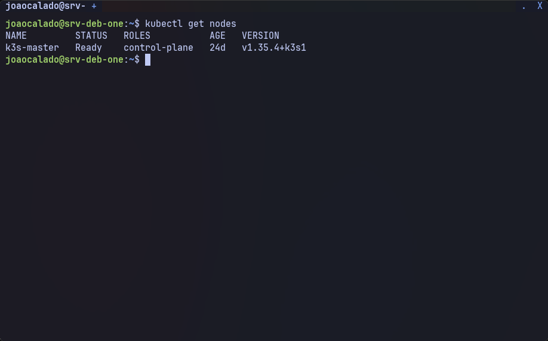
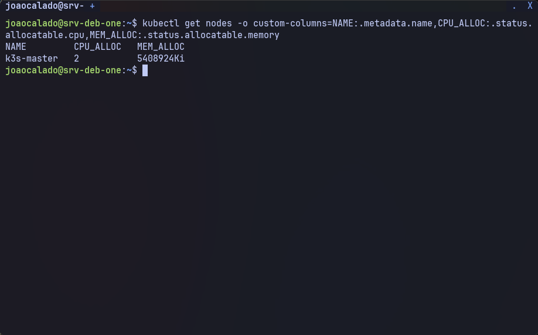
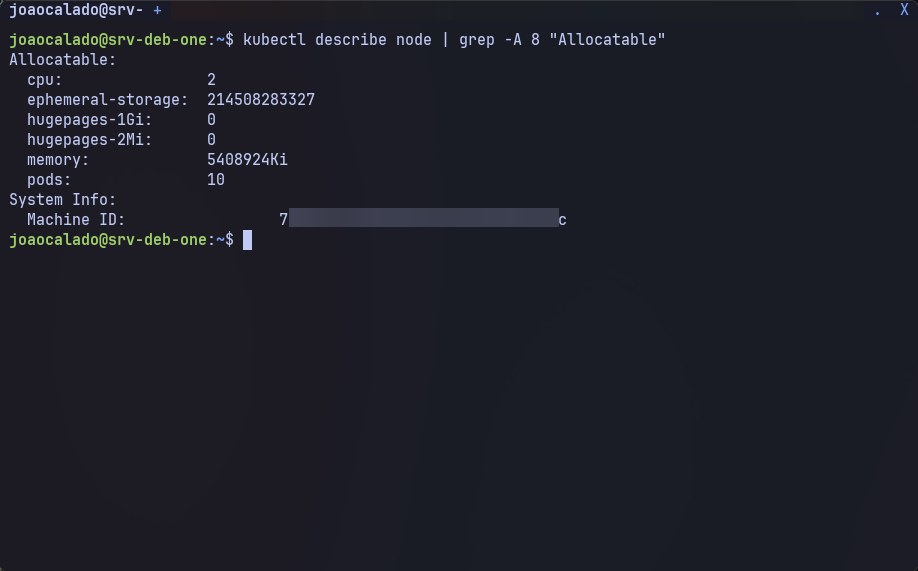
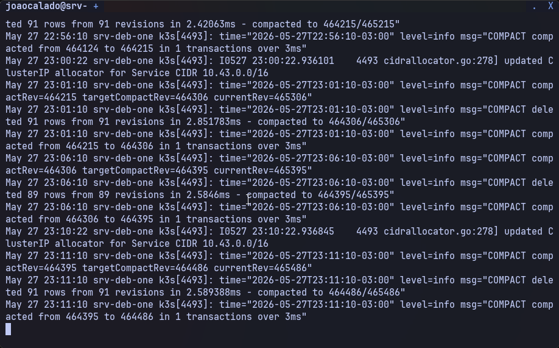

# 3. Instalação do K3s (master)

Este capítulo cobre a instalação do K3s em modo servidor (master). A configuração inclui fixação do IP, interface Wi-Fi, backend flannel, reservas de recursos e limite de pods.

> **Nota:** Substitua `192.168.1.200` pelo seu IP estático e `wlp3s0` pelo nome da sua interface Wi-Fi (descoberto com `ip link show` ou `iwconfig`). Ajuste também o nome da conexão Wi-Fi se necessário.

---

## 3.1. Instalação direta com os parâmetros finais

O comando a seguir instala o K3s já configurado como desejado, sem necessidade de editar o serviço systemd posteriormente.

1. Comando:

```sh
curl -sfL https://get.k3s.io | sh -s - server \
  --node-ip=192.168.1.200 \
  --flannel-iface=wlp3s0 \
  --flannel-backend=host-gw \
  --node-name=k3s-master \
  --kubelet-arg="system-reserved=cpu=1500m,memory=2Gi" \
  --kubelet-arg="kube-reserved=cpu=500m,memory=512Mi" \
  --kubelet-arg="max-pods=10" \
  --write-kubeconfig-mode=644
```

2. Descrição detalhada de cada parâmetro:

```text
server: Indica que este nó será o servidor (master) do cluster.

--node-ip=192.168.1.200: Força o K3s a anunciar esse IP específico. Essencial quando há múltiplas interfaces (ex.: Wi-Fi + loopback) para evitar que ele escolha a interface errada.

--flannel-iface=wlp3s0: Define qual interface de rede o flannel (CNI) deve usar. No nosso caso, a placa Wi-Fi. Sem isso, o flannel poderia tentar usar a interface loopback ou outra, quebrando a comunicação entre pods.

--flannel-backend=host-gw: Usa o backend "host-gw" (host gateway) do flannel. Em vez de VXLAN (overlay), ele cria rotas diretas no host, o que é mais simples e eficiente para redes locais (todos os nós no mesmo /24). Requer que os nós estejam no mesmo segmento de rede.

--node-name=k3s-master: Nome amigável do nó no cluster. Facilita a identificação.

--kubelet-arg="system-reserved=cpu=1500m,memory=2Gi": Reserva recursos do nó para processos do sistema (systemd, ssh, logs, etc.). Evita que o kubelet aloque todos os recursos para pods, garantindo estabilidade do sistema operacional.

--kubelet-arg="kube-reserved=cpu=500m,memory=512Mi": Reserva recursos para os próprios componentes do Kubernetes (kubelet, container runtime, etc.). Mantém o kubelet funcionando mesmo sob carga.

--kubelet-arg="max-pods=10": Limita o número total de pods neste nó. Reduz o consumo de IPs e evita sobrecarga em hardware limitado (como um notebook antigo).

--write-kubeconfig-mode=644: Permite que o usuário comum leia o arquivo kubeconfig (/etc/rancher/k3s/k3s.yaml). Necessário para executar comandos kubectl sem sudo.
```

**Necessidade dessas configurações para um K3s em rede local:**

```text
Em uma rede local simples (um único segmento /24, sem VLANs ou sobreposições complexas), o flannel com backend host-gw é a escolha mais adequada porque:
- Ele evita o overhead do VXLAN (encapsulamento), economizando CPU e banda.
- As rotas são criadas diretamente nas tabelas de roteamento dos nós, tornando a latência menor.
- Para que isso funcione, é obrigatório definir --node-ip (para que o K3s anuncie o IP correto) e --flannel-iface (para que o flannel saiba em qual interface escutar e propagar rotas). Sem esses parâmetros, o K3s pode usar o IP da interface loopback (127.0.0.1) ou outra interface não roteável, impossibilitando a comunicação entre nós.
```

---

## 3.2. Verificar a instalação

Após a instalação, aguarde alguns segundos e verifique o status do nó.

1. Comando:

```sh
kubectl get nodes
```

2. Saída:


Para ver os recursos alocáveis após as reservas:

1. Comando:

```sh
kubectl get nodes -o custom-columns=NAME:.metadata.name,CPU_ALLOC:.status.allocatable.cpu,MEM_ALLOC:.status.allocatable.memory
```

2. Saída:


Detalhes completos do nó:

1. Comando:

```sh
kubectl describe node | grep -A 8 "Allocatable"
```

2. Saída:


---

## 3.3. Verificar logs (opcional)

1. Comando:

```sh
journalctl -u k3s -f --lines=50
```

2. Descrição:

```text
Monitora os logs do serviço K3s. Procure por mensagens de erro relacionadas a rede ou DNS.
```

3. Saída:


---

## 3.4. Desinstalação (se necessário)

1. Comando:

```sh
sudo /usr/local/bin/k3s-uninstall.sh
```

2. Descrição:

```text
Remove o K3s, contêineres, imagens e a maioria dos arquivos de configuração. A interface de rede e IP estático não são alterados.
```

---

## Observação

```text
O token para adicionar nós workers está localizado em /var/lib/rancher/k3s/server/node-token. Guarde-o para uso futuro.

O arquivo kubeconfig está em /etc/rancher/k3s/k3s.yaml. Você pode copiá-lo para sua máquina local para gerenciar o cluster remotamente.
```

---

## ✅ Próximo passo

Com o K3s instalado e rodando com a configuração final, vamos realizar os ajustes finos de DNS e NetworkManager para evitar conflitos:

👉 [04-ajustes-finos.md](04-ajustes-finos.md)
