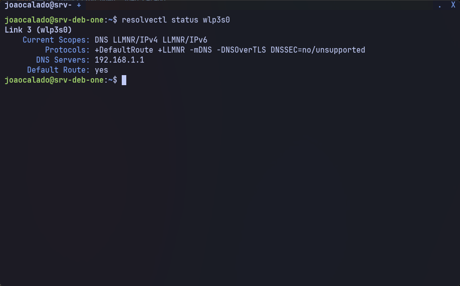
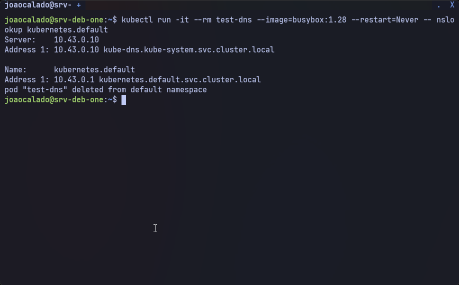

# 4. Ajustes finos: DNS e NetworkManager

Após instalar o K3s, o principal problema que pode ocorrer é o DNS interno do cluster (CoreDNS) ser ignorado porque o kubelet injeta muitos servidores DNS nos pods. Este capítulo resolve essa questão.

---

## 4.1. Reduzir os servidores DNS do host para apenas um

O kubelet monta o `/etc/resolv.conf` dos pods com os DNS do host **mais** o IP do CoreDNS (`10.43.0.10`). Se o host tiver mais de 3 servidores, o CoreDNS é removido da lista, quebrando a resolução de nomes interna (ex.: `kubernetes.default` não resolve).

A solução é deixar o host com **apenas um** servidor DNS – normalmente o roteador local (`192.168.1.1`). Ele encaminhará as consultas para outros DNS upstream.

1. Comando (substitua `"JOAO CALADO"` pelo nome da sua conexão Wi-Fi):

```sh
sudo nmcli connection modify "JOAO CALADO" ipv4.dns "192.168.1.1"
sudo nmcli connection down "JOAO CALADO"
sudo nmcli connection up "JOAO CALADO"
```

2. Descrição:

```text
nmcli connection modify: Altera a configuração da conexão para usar apenas o DNS 192.168.1.1.
nmcli connection down/up: Reinicia a conexão para aplicar a mudança.
```

**Verifique**:

1. Comando:

```sh
resolvectl status wlp3s0   # substitua wlp3s0 pela sua interface Wi-Fi
```

2. Saída:


> A saída deve mostrar apenas `192.168.1.1` em `DNS Servers`.

**Teste do DNS interno do cluster**:

1. Comando:

```sh
kubectl run -it --rm test-dns --image=busybox:1.28 --restart=Never -- nslookup kubernetes.default
```

2. Saída:


> Se o comando falhar ou não encontrar o servidor `10.43.0.10`, repita os passos de configuração do DNS do host.

---

## Observação sobre NetworkManager

```text
Em alguns ambientes, o NetworkManager pode tentar gerenciar as interfaces virtuais criadas pelo K3s (flannel.1, cni0, veth*), causando instabilidade. No entanto, na instalação descrita neste guia, as interfaces já aparecem como "unmanaged" ou "connected (externally)" sem necessidade de configuração adicional. Se você notar problemas, pode adicionar a seguinte configuração em /etc/NetworkManager/NetworkManager.conf:

[keyfile]
unmanaged-devices=interface-name:flannel.1;interface-name:cni0;interface-name:veth*

Depois reinicie o NetworkManager: sudo systemctl restart NetworkManager.
```

---

## ✅ Próximo passo

Com o DNS ajustado, o cluster está pronto para receber o watchdog do Wi-Fi, que garantirá a resiliência da conexão:

👉 [05-watchdog-wifi.md](05-watchdog-wifi.md)
