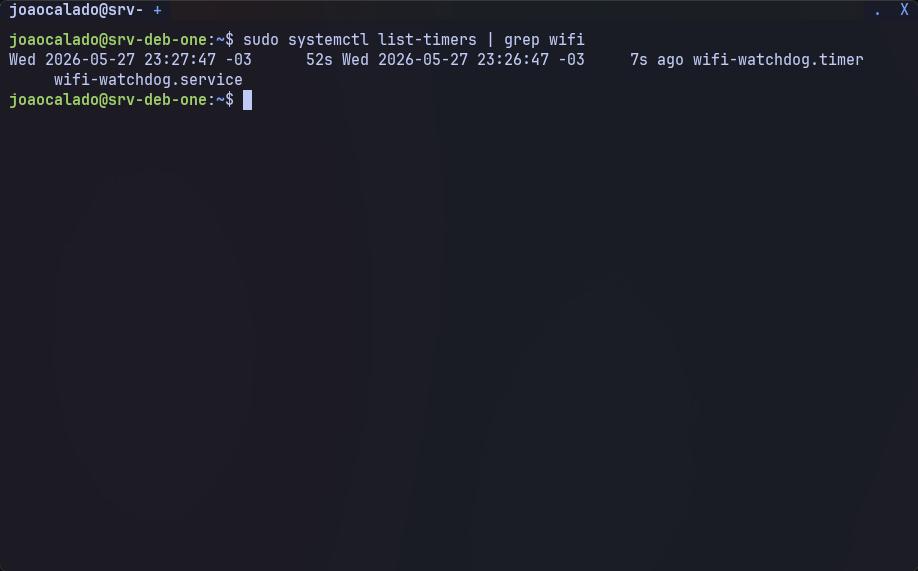
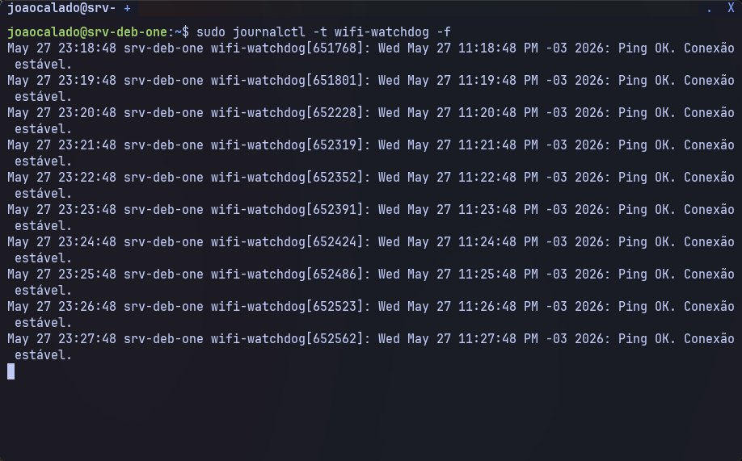
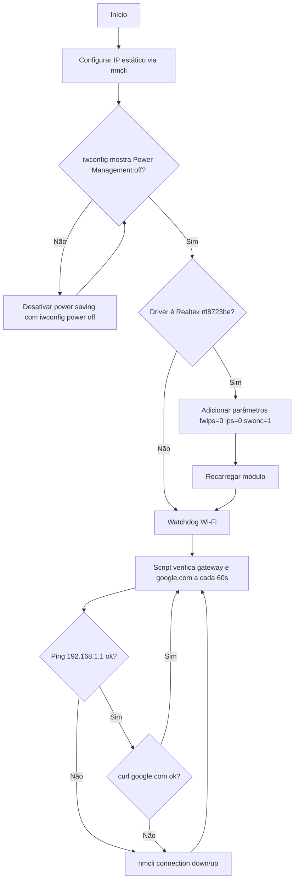

# 5. Watchdog Wi‑Fi – Reciclagem automática da conexão

**Problema:** mesmo com todos os ajustes anteriores, o driver da placa Wi‑Fi (especialmente o Realtek RTL8723BE) pode travar após algumas horas. A interface `wlp3s0` ainda aparece UP, mas o tráfego de rede não flui (ping falha, SSH e HTTP param de responder). A solução manual é reciclar a conexão com `nmcli connection down/up`.

**Solução definitiva:** um script executado a cada 60 segundos que verifica a conectividade com o gateway (`192.168.1.1`) e com um domínio público (`google.com`). Se o ping ou a verificação TCP (curl) falhar, o script derruba e sobe a conexão Wi‑Fi automaticamente.

---

## 5.1. Criar o script de verificação

1. Comando para criar o arquivo do script:

```sh
sudo nano /usr/local/bin/wifi-watchdog.sh
```

2. Conteúdo do script (substitua `"JOAO CALADO"` pelo nome da sua conexão Wi‑Fi, se necessário):

```bash
#!/bin/bash
GATEWAY="192.168.1.1"
TARGET="google.com"
CONNECTION="JOAO CALADO"

if ! ping -c 2 -W 5 "$GATEWAY" > /dev/null 2>&1 || ! curl -s --connect-timeout 5 http://$TARGET/ > /dev/null 2>&1; then
    echo "$(date): Ping ou TCP falhou. Reciclando conexão Wi-Fi..." | systemd-cat -t wifi-watchdog
    nmcli connection down "$CONNECTION"
    sleep 3
    nmcli connection up "$CONNECTION"
else
    echo "$(date): Ping e TCP OK. Conexão estável." | systemd-cat -t wifi-watchdog
fi
```

3. Tornar o script executável:

```sh
sudo chmod +x /usr/local/bin/wifi-watchdog.sh
```

4. Descrição do script:

```text
GATEWAY: IP do roteador (padrão 192.168.1.1). Altere se o seu for diferente.
TARGET: Domínio público para verificação TCP via curl (padrão google.com).
CONNECTION: Nome exato da conexão Wi‑Fi gerenciada pelo NetworkManager.
ping -c 2 -W 5: Envia 2 pacotes ICMP, aguardando no máximo 5 segundos por resposta.
curl -s --connect-timeout 5: Tenta baixar a página do domínio alvo, com timeout de 5 segundos.
Se o ping ou o curl falharem (código de saída diferente de 0), o script:
  - Registra a data e a mensagem no journal do systemd com a tag "wifi-watchdog".
  - Executa nmcli connection down para derrubar a conexão.
  - Aguarda 3 segundos.
  - Executa nmcli connection up para reestabelecer a conexão.
Se ambos passarem, registra "Ping e TCP OK. Conexão estável." no journal.
```

---

## 5.2. Criar o serviço systemd (executa o script uma vez)

1. Comando para criar o arquivo de serviço:

```sh
sudo nano /etc/systemd/system/wifi-watchdog.service
```

2. Conteúdo:

```ini
[Unit]
Description=Watchdog de Wi-Fi – recicla conexão se o gateway não responder

[Service]
Type=oneshot
ExecStart=/usr/local/bin/wifi-watchdog.sh
User=root
```

3. Descrição:

```text
Type=oneshot: Indica que o serviço executa uma tarefa única e termina.
ExecStart: Caminho para o script criado anteriormente.
User=root: O script precisa de privilégios para executar nmcli.
```

---

## 5.3. Criar o timer systemd (dispara o serviço a cada 60 segundos)

1. Comando para criar o arquivo do timer:

```sh
sudo nano /etc/systemd/system/wifi-watchdog.timer
```

2. Conteúdo:

```ini
[Unit]
Description=Dispara o wifi-watchdog a cada 60s

[Timer]
OnBootSec=60s
OnUnitActiveSec=60s
Unit=wifi-watchdog.service

[Install]
WantedBy=timers.target
```

3. Descrição:

```text
OnBootSec=60s: Primeira execução 60 segundos após a inicialização do sistema.
OnUnitActiveSec=60s: Executa novamente a cada 60 segundos após a última execução.
Unit=wifi-watchdog.service: Nome do serviço que será disparado.
WantedBy=timers.target: Ativa o timer no boot.
```

---

## 5.4. Ativar e iniciar o timer

```sh
sudo systemctl daemon-reload
sudo systemctl enable --now wifi-watchdog.timer
```

Descrição:

```text
systemctl daemon-reload: Recarrega as definições de serviço/timer.
systemctl enable --now: Ativa o timer para iniciar no boot e já o dispara agora.
```

---

## 5.5. Verificar o funcionamento

1. Status do timer:

```sh
sudo systemctl status wifi-watchdog.timer
```

2. Listar timers ativos:

```sh
sudo systemctl list-timers | grep wifi
```


3. Acompanhar logs do watchdog em tempo real:

```sh
sudo journalctl -t wifi-watchdog -f
```


Exemplo de saída quando ocorre uma falha:

```text
Sun 2026-06-21 22:35:53 -03: Ping ou TCP falhou. Reciclando conexão Wi-Fi...
Sun 2026-06-21 22:36:53 -03: Ping e TCP OK. Conexão estável.
```

4. Teste manual (opcional): desligue o roteador por alguns segundos, bloqueie o tráfego para o gateway ou derrube a conexão com `nmcli connection down "JOAO CALADO"`. Após alguns segundos, o script deve registrar a falha e reciclar a conexão automaticamente.

---

## 5.6. Desativar o watchdog (se necessário)

```sh
sudo systemctl disable --now wifi-watchdog.timer
sudo rm /etc/systemd/system/wifi-watchdog.{service,timer}
sudo systemctl daemon-reload
```

Descrição:

```text
disable --now: Para o timer e impede que ele inicie no boot.
rm: Remove os arquivos de serviço e timer.
daemon-reload: Limpa o cache do systemd.
```

---

## 5.7. Fluxograma da configuração do Wi-Fi e watchdog


---

## Observação

```text
Este watchdog mitiga um problema não resolvido na causa raiz: o driver Wi‑Fi (possivelmente rtl8723be) apresenta travamentos periódicos. A reciclagem da conexão restaura o funcionamento sem reiniciar o K3s ou o notebook. Caso você tenha um driver estável, este passo pode ser opcional, mas é altamente recomendado para hardware antigo ou problemático.
```

---

## ✅ Próximo passo

Com o watchdog ativo, o cluster tem conectividade resiliente. Agora vamos implantar a primeira aplicação de teste:

👉 [06-primeira-aplicacao.md](06-primeira-aplicacao.md)
