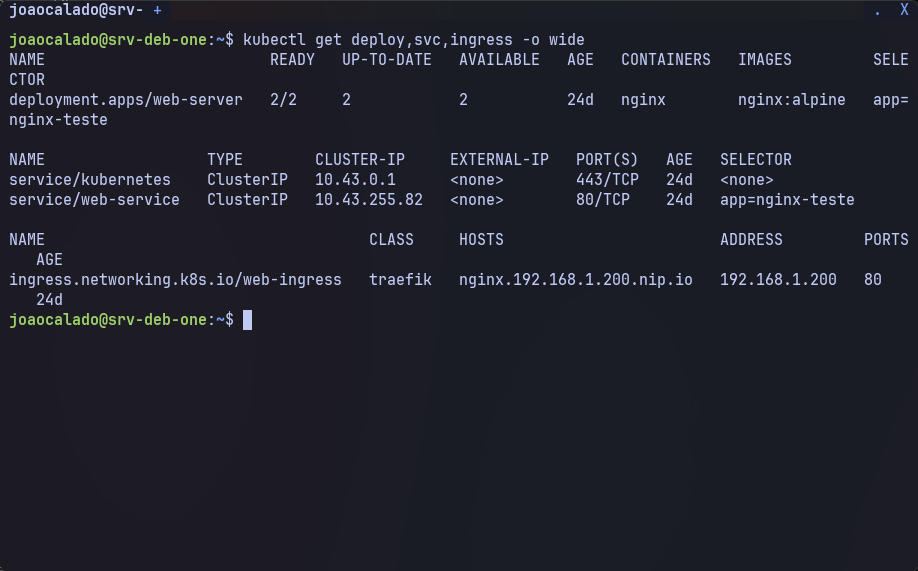
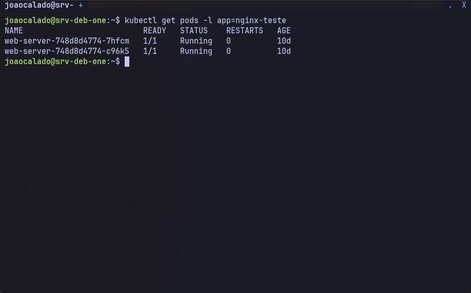
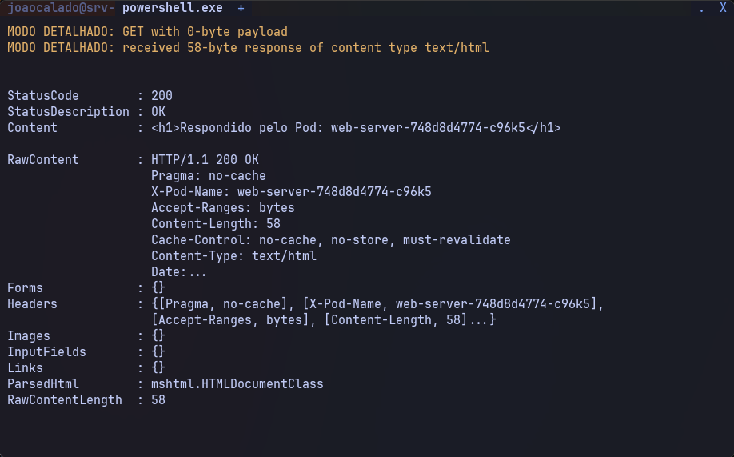
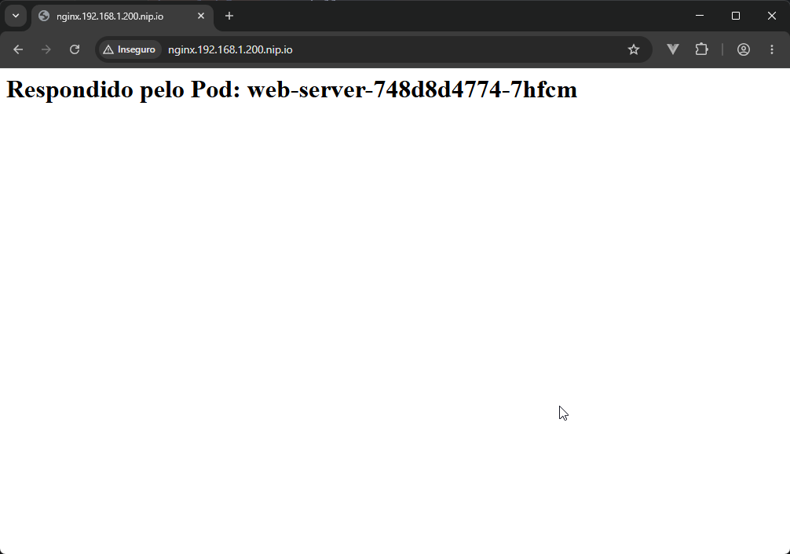

# 6. Primeira aplicação (versão básica)

Este capítulo implanta uma aplicação web simples (Nginx) com 2 réplicas, exposta internamente via Service e externamente via Ingress. A versão básica não possui cabeçalhos anti‑cache – isso será adicionado no próximo passo.

O manifesto utilizado cria:
- **Deployment** `web-server` com 2 réplicas da imagem `nginx:alpine`.
- **Service** `web-service` do tipo ClusterIP (porta 80).
- **Ingress** `web-ingress` para o host `nginx.192.168.1.200.nip.io`.

> **Nota:** Substitua `192.168.1.200` pelo IP do seu notebook, caso seja diferente.

---

## 6.1. Criar o arquivo de manifesto básico

1. Comando para criar o arquivo (dentro do diretório `manifests/` do repositório):

```sh
mkdir -p manifests
nano manifests/app-basic.yaml
```

2. Conteúdo do arquivo `manifests/app-basic.yaml`:

```yaml
apiVersion: apps/v1
kind: Deployment
metadata:
  name: web-server
spec:
  replicas: 2
  selector:
    matchLabels:
      app: nginx-teste
  template:
    metadata:
      labels:
        app: nginx-teste
    spec:
      containers:
      - name: nginx
        image: nginx:alpine
        ports:
        - containerPort: 80
---
apiVersion: v1
kind: Service
metadata:
  name: web-service
spec:
  selector:
    app: nginx-teste
  ports:
    - protocol: TCP
      port: 80
      targetPort: 80
---
apiVersion: networking.k8s.io/v1
kind: Ingress
metadata:
  name: web-ingress
spec:
  rules:
  - host: nginx.192.168.1.200.nip.io
    http:
      paths:
      - path: /
        pathType: Prefix
        backend:
          service:
            name: web-service
            port:
              number: 80
```

3. Descrição do manifesto:

```text
Deployment: Cria 2 réplicas do nginx:alpine, cada uma escutando na porta 80.
Service: Expõe as réplicas internamente no cluster através do selector app=nginx-teste.
Ingress: Configura o controlador Traefik (já presente no K3s) para rotear requisições HTTP para o Service. O domínio nip.io resolve para o IP fornecido (192.168.1.200), tornando dispensável a configuração de DNS.
```

---

## 6.2. Aplicar o manifesto no cluster

1. Comando:

```sh
kubectl apply -f manifests/app-basic.yaml
```

2. Descrição:

```text
Cria ou atualiza os recursos definidos no arquivo YAML. O Kubernetes iniciará os pods, o Service e o Ingress.
```

---

## 6.3. Verificar os recursos criados

1. Ver todos os recursos (Deployment, Service, Ingress):

```sh
kubectl get deploy,svc,ingress -o wide
```

2. Saída:


3. Ver os pods em execução:

```sh
kubectl get pods -l app=nginx-teste
```

4. Saída:


---

## 6.4. Testar a aplicação internamente (via Service)

1. Executar um pod temporário com `curl` e acessar o Service pelo nome:

```sh
kubectl run -it --rm test-nginx --image=curlimages/curl --restart=Never -- curl -s http://web-service.default.svc.cluster.local
```

2. Descrição:

```text
O pod temporário fará uma requisição HTTP ao Service web-service no namespace default. A resposta será a página padrão do Nginx (não mostra o nome do pod). Repita o comando várias vezes para perceber o balanceamento (embora o conteúdo seja idêntico).
```

---

## 6.5. Testar a aplicação externamente (via Ingress)

1. No próprio notebook ou em qualquer máquina da mesma rede:

```sh
curl -v http://nginx.192.168.1.200.nip.io
```

2. Descrição:

```text
O Ingress roteará a requisição para o Service web-service, que por sua vez encaminhará para um dos pods. A resposta será a página padrão do Nginx. O cabeçalho de resposta não inclui o nome do pod (isso será adicionado no próximo passo).
```

3. Saída:


---

## 6.6. Acessar pelo navegador

Abra o navegador e acesse `http://nginx.192.168.1.200.nip.io`. Atualize a página várias vezes. Devido ao keep‑alive (HTTP persistente), o navegador pode mostrar sempre o mesmo conteúdo, não evidenciando o balanceamento. O próximo passo resolve essa limitação com cabeçalhos anti‑cache e a inclusão do nome do pod na resposta.



---

## Observação

```text
O manifesto básico não inclui recursos de CPU/memória nem variáveis de ambiente. Para um ambiente de aprendizado, isso é suficiente. Nos passos seguintes, adicionaremos limites de recursos e a lógica de anti‑cache.
```

---

## ✅ Próximo passo

A aplicação básica está no ar. Agora vamos aprimorá‑la com cabeçalhos anti‑cache e um cabeçalho personalizado mostrando qual pod respondeu:

👉 [07-anti-cache.md](07-anti-cache.md)
