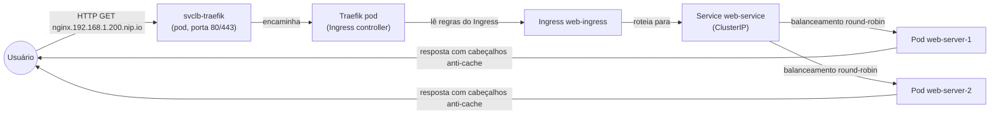

# 10. Estado atual e diagnóstico rápido

Este capítulo descreve o **estado esperado** do cluster após seguir todos os passos anteriores e fornece um roteiro de diagnóstico para quando algo falha.

> **Nota:** Os endereços IP e nomes de interface aqui utilizados são exemplos (`192.168.1.200`, `wlp3s0`). Substitua pelos valores da sua própria rede.

---

## 10.1. Nós e recursos alocáveis

1. Comando:

```sh
kubectl get nodes
```

Saída esperada:

```text
NAME          STATUS   ROLES                  AGE   VERSION
k3s-master    Ready    control-plane,master   1d    v1.32.2+k3s1
```

2. Ver recursos alocáveis (após as reservas `system-reserved` e `kube-reserved`):

```sh
kubectl get nodes -o custom-columns=NAME:.metadata.name,CPU_ALLOC:.status.allocatable.cpu,MEM_ALLOC:.status.allocatable.memory
```

Exemplo:

```text
NAME          CPU_ALLOC   MEM_ALLOC
k3s-master    1950m       5620Mi
```

Descrição:

```text
O nó está "Ready". CPU e memória alocáveis são os valores que o kubelet pode reservar para pods (total do nó menos as reservas definidas em --kubelet-arg).
```

---

## 10.2. Pods do sistema (namespace `kube-system`)

1. Comando para listar:

```sh
kubectl get pods -n kube-system
```

2. Tabela descritiva de cada pod:

```text
coredns-*: DNS interno do cluster (IP fixo 10.43.0.10). Essencial para resolução de nomes entre serviços.
local-path-provisioner-*: Provisionador de volumes locais. Cria PersistentVolumes a partir do disco do nó.
metrics-server-*: Coleta métricas de CPU/memória para kubectl top e HPA.
svclb-traefik-*: Load balancer simples do K3s. Escuta nas portas 80 e 443 do nó e encaminha para o Traefik.
traefik-*: Ingress controller. Lê os recursos Ingress e roteia as requisições HTTP/S para os serviços backend.
helm-install-traefik-*: Pod temporário (Completed) que instalou o Traefik via Helm. Pode ser removido com segurança.
```

---

## 10.3. Pods da aplicação (namespace `default`)

1. Comando:

```sh
kubectl get pods -l app=nginx-teste
```

Saída esperada:

```text
NAME                           READY   STATUS    RESTARTS   AGE
web-server-xxxxx-yyyyy         1/1     Running   0          1h
web-server-xxxxx-zzzzz         1/1     Running   0          1h
```

---

## 10.4. Fluxo de uma requisição externa

```text
Navegador (cliente)
       │
       │ HTTP GET / → http://nginx.192.168.1.200.nip.io
       ▼
   Notebook (porta 80 – escutada pelo svclb-traefik)
       │
       │ iptables redireciona para o pod svclb-traefik
       ▼
   Pod svclb-traefik (namespace kube-system)
       │
       │ Encaminha para o Service do Traefik (ClusterIP)
       ▼
   Pod traefik (namespace kube-system)
       │
       │ Lê as regras do Ingress web-ingress (host: nginx.192.168.1.200.nip.io)
       ▼
   Service web-service (ClusterIP, porta 80, namespace default)
       │
       │ Balanceamento round‑robin entre os pods web-server
       ▼
   Pod web-server-xxxxx-yyyyy (ou o outro)
       │
       │ Resposta HTML com cabeçalhos anti‑cache e X-Pod-Name
       ▼
   Navegador – exibe a página e mostra qual pod respondeu
```

---

## 10.5. Diagnóstico rápido (ordem sugerida)

Siga os passos abaixo para identificar a causa de problemas.

### 1. Conectividade Wi‑Fi

```sh
ping 192.168.1.1
```

Se falhar, verifique os logs do watchdog:

```sh
journalctl -t wifi-watchdog -n 10
```

### 2. Logs do K3s

```sh
journalctl -u k3s -f --lines=50
```

Procure por mensagens como `failed to start`, `nameserver limits`, `failed to sync`, `connection refused`.

### 3. Estado dos pods

```sh
kubectl get pods -A
```

Pods com `CrashLoopBackOff`, `ImagePullBackOff`, `Pending` ou `Error`.

### 4. Eventos do cluster

```sh
kubectl get events -A --sort-by='.lastTimestamp'
```

Os eventos mais recentes aparecem por último. Veja se há `FailedScheduling`, `FailedMount`, `Unhealthy`, etc.

### 5. Ingress / Traefik

```sh
kubectl get pods -n kube-system -l app.kubernetes.io/name=traefik
kubectl logs -n kube-system -l app.kubernetes.io/name=traefik --tail=20
```

### 6. DNS interno do cluster

```sh
kubectl run -it --rm test-dns --image=busybox:1.28 --restart=Never -- nslookup kubernetes.default
```

Se não resolver, reveja o capítulo 4 (ajustes de DNS) e confirme que o host só tem um servidor DNS (`192.168.1.1`).

### 7. Recurso do nó (CPU/memória)

```sh
kubectl top nodes
kubectl top pods -A
```

Se muitos pods estiverem em `Pending` com eventos de `Insufficient memory` ou `Insufficient cpu`, reduza as reservas ou aumente as réplicas do cluster.

---

## 10.6. Arquitetura do cluster K3s (fluxo da requisição)


---

## Observação

```text
Este guia foi testado em um notebook com Debian 13, 4 vCPUs, 8 GB RAM e Wi-Fi Realtek. Os sintomas e soluções podem variar conforme o hardware, mas os conceitos apresentados (anti‑cache, watchdog, reservas de recursos) são universais.
```

---

## ✅ Próximo passo (encerramento)

Você concluiu a configuração completa do homelab! Para continuar seus estudos como eu, explore outros componentes do Kubernetes como:

- PersistentVolumes e PersistentVolumeClaims.
- ConfigMaps e Secrets.
- Horizontal Pod Autoscaler (HPA).
- Helm charts.

Consulte a [documentação oficial do K3s](https://docs.k3s.io) e do [Kubernetes](https://kubernetes.io/docs/home/) para aprofundar.

**Obrigado por seguir este guia!**
